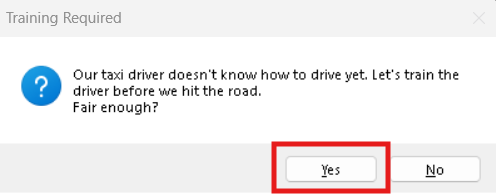
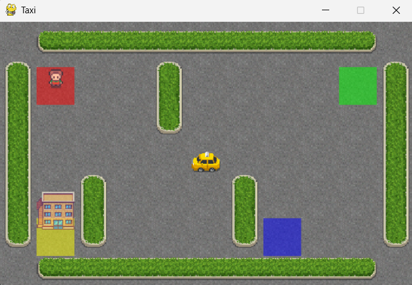

# Reinforcement Learning Programming (CSCN8020) - Assignment 2

## 👥 Author

Mostafa Allahmoradi - 9087818

## 📌 Assignment Overview

This assignment demonstrates the implementation of Q-Learning and Deep Q-Learning (DQN) within the 'Taxi-v3' OpenAI Gym environment.

For a detailed overview of the project requirements, please refer to CSCN8020_Assignment2.pdf located in the root directory.

## 🎯 How to Run:

1. **Clone this repository:**

   ```bash
   git clone <repo-url>
   cd <repo-folder>
   ```
2. **Create a Virtual Environment**
* Windows:
    ```bash
   python -m venv .venv
   ```

* macOS / Linux:
```bash
   python3 -m venv venv
   ```

3. **Activate the Virtual Environment**
* On Windows (Command Prompt):
    ```bash
   .venv\Scripts\Activate
   ```

* On macOS / Linux:
    ```bash
   source venv/bin/activate
   ```

4. **Install Required Dependencies:**

   ```bash
   pip install -r requirements.txt
   ```

5. **Enjoy the fun Yellow Drift game**

    ```bash
   python yellow_drift.py --alpha 0.2 --epsilon-decay --gamma 0.9 --episodes 5000 --log-file training_log.txt
   ```

What you will see:

1. A Tkinter pop-up will ask if you want to train the driver. Click Yes.



2. The training window will appear and process the 5,000 episodes.


3. Once training is complete, the visual Taxi game will pop up, and you will see your optimally trained driver easily navigating the grid to pick up and drop off passengers!



4. You can play again or close the game!

